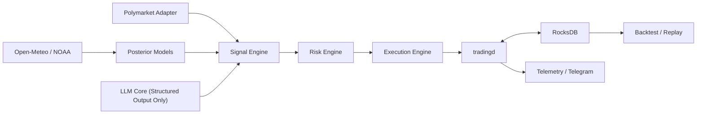

# Tenkinoko

[](https://github.com/zhengui666/tenkinoko/actions/workflows/ci.yml)
[](https://www.rust-lang.org/)
[](https://github.com/zhengui666/tenkinoko/blob/main/LICENSE)
[](https://github.com/zhengui666/tenkinoko)

> 面向 **Polymarket 天气市场** 的单机自动交易守护进程。  
> 目标不是“更快地下单”，而是把 **历史可用天气预报、多源校准模型、严格风控** 组合成一套可恢复、可回放、可维护的短周期交易系统。

## Overview

Tenkinoko 是一个用 Rust 构建的生产导向项目，聚焦真实资金场景下的天气合约交易。

它围绕以下原则设计：

- 单机部署，适配低配服务器
- `RocksDB` 作为唯一持久化存储
- 单主写组件负责订单、持仓和风险状态
- 事件驱动、可恢复、可回放
- LLM 仅作为受约束的辅助模块，不直接产生裸交易指令

## Why This Project

天气市场并不适合“看一眼价格就追单”的做法。Tenkinoko 关注的是：

- 市场可执行隐含概率与模型后验分布之间的偏差
- 多天气源之间的一致性、发散程度与数据质量
- 45 分钟到 12 小时这一更适合天气更新节奏的持有窗口
- 风险上限、相关暴露、异常状态切换与崩溃恢复

这意味着项目的优化方向是：

- 正确性优先于吞吐
- 风控优先于回测观感
- 可解释与可恢复优先于堆砌服务

## Core Principles

### Trading Scope

- 交易场所：`Polymarket`
- 交易领域：`weather only`
- 优先市场：
  - 日最高温
  - 日最低温
  - 阈值型天气结果
- 优先持有周期：`45 minutes to 12 hours`
- 允许持有周期：`15 minutes to 1 day`

### Risk Discipline

- 单市场单头寸暴露上限：`<= 2% total equity`
- 同城市 / 同日期 / 同天气状态的相关暴露需要硬限制
- 风险状态至少支持：
  - `Normal`
  - `Cautious`
  - `ReduceOnly`
  - `HaltOpen`
  - `EmergencyFlat`

### LLM Guardrails

LLM 只允许用于：

- 市场规则解析
- 模糊条款消歧
- 天气讨论摘要
- 源间分歧解释
- 日报与复盘归因

LLM 不允许直接决定：

- 是否开仓
- 仓位大小
- 绕过风控

## Architecture



默认部署形态很克制：

- `apps/tradingd` 是主入口，也是唯一交易写入者
- 可选 `telegram-bot` 负责只读通知与运维辅助
- 模块边界清晰，但不把系统拆成大量独立服务

## Workspace Layout

当前工作区由一个主应用和多个领域 crate 组成：

| 模块 | 职责 |
| --- | --- |
| `apps/tradingd` | 主进程，负责启动、调度、执行交易周期 |
| `domain-core` | 核心领域模型、状态与类型定义 |
| `config-core` | 配置加载与运行参数管理 |
| `storage-rocksdb` | RocksDB 列族、序列化与恢复 |
| `polymarket-adapter` | 市场元数据、规则和行情接入 |
| `weather-adapter-openmeteo` | Open-Meteo 数据接入 |
| `weather-adapter-noaa` | NOAA 或官方源数据接入 |
| `posterior-models` | 概率建模、分桶与后验计算 |
| `signal-engine` | 从后验和市场价格生成信号 |
| `risk-engine` | 风险约束、状态切换、仓位限制 |
| `execution-engine` | 下单、撤单、对账与执行状态机 |
| `llm-core` | 严格结构化的 LLM 辅助能力 |
| `scheduler-core` | 周期任务与调度逻辑 |
| `telemetry-core` | 结构化日志与观测输出 |
| `telegram-bot` | Telegram 运维通知 |
| `backtest-engine` | 回测、重放与验证 |

## What Exists Today

根据当前仓库结构与入口代码，项目已经具备这些骨架能力：

- 多 crate Rust workspace
- `tradingd` 作为统一启动入口
- `run-once` 与 `daemon` 两种主运行模式
- 市场发现、信号回放、执行回放、执行健康检查等命令入口
- `RocksDB` 持久化设计
- 信号、风控、执行、天气接入等模块划分

当前仍应被视为一个**正在完善中的交易系统代码库**，而不是已经宣称可直接实盘部署的成品。

## Quick Start

### Prerequisites

- Rust stable toolchain
- 支持构建本项目依赖的本地编译环境
- 可选：Polymarket API 凭证、天气源访问配置、Telegram 凭证

### Build

```bash
cargo build --release
```

### Example Commands

```bash
# 运行一次完整交易周期
cargo run --release --bin tradingd -- run-once

# 启动守护进程
cargo run --release --bin tradingd -- daemon

# 发现可交易市场
cargo run --release --bin tradingd -- discover-markets

# 回放信号
cargo run --release --bin tradingd -- replay

# 回放执行
cargo run --release --bin tradingd -- replay-execution

# 执行健康检查
cargo run --release --bin tradingd -- execution-health
```

## Design Choices

### Single Writer

订单提交、撤单、持仓状态和实时风险状态必须由单一组件统一写入，避免并发写者破坏一致性。

### RocksDB Only

项目刻意避免引入 PostgreSQL、Redis、Kafka、NATS、Elastic、ClickHouse 等额外基础设施，优先保证：

- 内存占用可控
- 运维成本可控
- 单机恢复路径清晰

### Maker-First Execution

默认执行风格是：

- 优先挂单
- 只有在边际足够大且时间约束成立时才考虑主动吃单
- 不做盲目追价，也不做高频撮合式循环

## Backtesting Requirements

这个项目对回测有非常明确的边界：

- 禁止未来数据泄漏
- 优先使用“决策当时可见”的历史预报，而不是事后观测
- LLM 参与历史重放时，需要遵守日期混淆规则
- 回测应支持流式处理，避免在低配机器上把大数据集一次性读入内存

## Operational Notes

真实交易前需要你自己完成：

- 环境变量与凭证配置
- 账户、网络和地理访问条件确认
- 风险限额设置
- 数据源可用性与延迟验证
- 纸面回放或仿真验证

项目不会把“有 LLM”包装成自动赚钱按钮。

## Roadmap

- 完善回测与事件重放链路
- 补齐 Telegram 运维能力
- 增强天气源覆盖和模型校准
- 强化恢复、对账和异常状态测试
- 为关键策略约束补充更多测试和验证样例

## Contribution

欢迎围绕以下方向提交改进：

- 风控约束与状态机清晰化
- RocksDB schema 与恢复路径优化
- 历史预报回测质量提升
- 文档、测试与 replay fixture 补全

不欢迎与项目目标冲突的改动，例如：

- 多数据库扩展
- 微服务化拆分
- 追求高频做市
- 用 prompt 直接替代概率模型与风控

提交代码前，请先阅读 [CONTRIBUTING.md](/Users/zhangzeyuan/opt/tenkinoko/CONTRIBUTING.md)。

## Disclaimer

本项目涉及真实资金交易系统设计。仓库中的实现、接口和命令示例不构成投资建议，也不意味着默认适合直接实盘使用。任何真实部署都应建立在独立测试、风险审查与资金约束之上。
