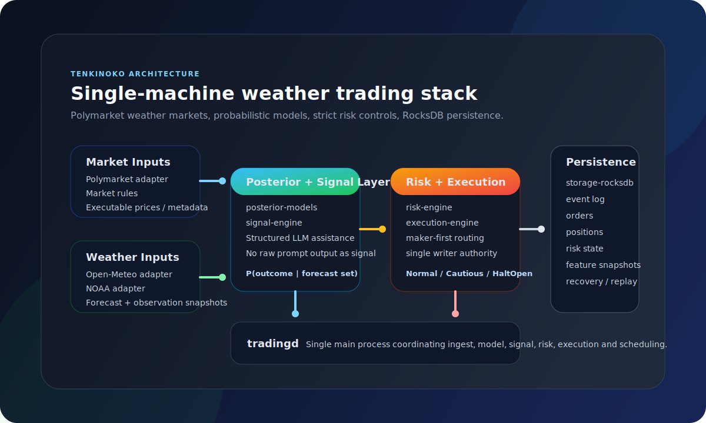
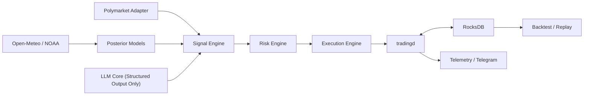
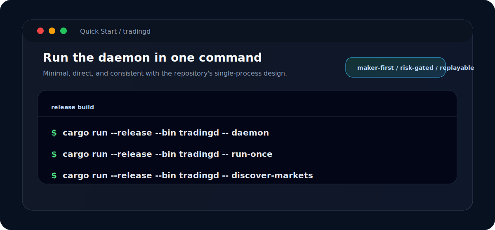

# Tenkinoko

[](https://github.com/zhengui666/tenkinoko/actions/workflows/ci.yml)
[](https://www.rust-lang.org/)
[](./LICENSE)
[](https://github.com/zhengui666/tenkinoko)

> A single-machine automated trading daemon for **Polymarket weather markets**.
> The goal is not "faster order placement", but a recoverable, replayable, maintainable short-horizon trading system built on **historical forecast availability, multi-source calibrated models, and strict risk controls**.

Language:
[English](./README.md) | [简体中文](./README.zh-CN.md)

<p align="center">
  
</p>

## At A Glance

- `Polymarket weather only`: the repository is intentionally scoped to weather markets, not a generic multi-exchange platform.
- `single-machine runtime`: the system is organized around one main process, `tradingd`.
- `RocksDB only`: one storage engine, one trading writer, a clear recovery path.
- `probability-first`: trading decisions come from the gap between model posteriors and executable market-implied probability.
- `risk-gated`: signals never bypass risk checks or execution state machines.

## Contents

- [Overview](#overview)
- [Why This Project](#why-this-project)
- [Core Principles](#core-principles)
- [Architecture](#architecture)
- [Workspace Layout](#workspace-layout)
- [What Exists Today](#what-exists-today)
- [Quick Start](#quick-start)
- [Design Choices](#design-choices)
- [Backtesting Requirements](#backtesting-requirements)
- [Operational Notes](#operational-notes)
- [Roadmap](#roadmap)
- [Contribution](#contribution)
- [Disclaimer](#disclaimer)

## Overview

Tenkinoko is a production-oriented Rust project for real-money weather contract trading.

It is designed around the following principles:

- single-machine deployment on low-spec hardware
- `RocksDB` as the only persistent store
- a single writer for orders, positions, and live risk state
- event-driven, recoverable, and replayable workflows
- LLMs used only as constrained assistants, never as raw trading signal generators

## Why This Project

Weather markets are not a good fit for momentum-chasing or prompt-only forecasting.
Tenkinoko focuses on:

- the gap between executable implied probability and calibrated model posterior distributions
- consistency, divergence, and data quality across multiple weather sources
- a holding window closer to weather update cadence: `45 minutes to 12 hours`
- hard exposure caps, correlated risk limits, anomalous-state transitions, and crash recovery

This leads to a clear optimization order:

- correctness over throughput
- risk control over backtest optics
- interpretability and recoverability over service sprawl

## Core Principles

### Trading Scope

- Venue: `Polymarket`
- Domain: `weather only`
- Preferred markets:
  - daily high temperature
  - daily low temperature
  - threshold-based weather outcomes
- Preferred holding window: `45 minutes to 12 hours`
- Allowed holding window: `15 minutes to 1 day`

### Risk Discipline

- Maximum exposure per market position: `<= 2% total equity`
- Correlated exposure across the same city, date, or weather regime must have conservative hard caps
- Risk states must include at least:
  - `Normal`
  - `Cautious`
  - `ReduceOnly`
  - `HaltOpen`
  - `EmergencyFlat`

For sensitive disclosures and reporting guidance, see [SECURITY.md](./SECURITY.md).

### LLM Guardrails

LLMs are allowed only for:

- market rule parsing
- ambiguity resolution
- weather-discussion summarization
- source-divergence explanation
- daily reporting and post-trade attribution

LLMs are not allowed to directly decide:

- whether to enter a position
- how large a position should be
- whether risk checks can be bypassed

## Architecture



The default deployment shape is intentionally compact:

- `apps/tradingd` is the main entry point and the only trading writer
- optional `telegram-bot` functionality is read-only and operationally supportive
- module boundaries stay explicit without splitting the system into many services

The static architecture illustration lives at [.github/assets/architecture-overview.svg](./.github/assets/architecture-overview.svg).

## Workspace Layout

The workspace contains one main application plus multiple domain crates:

| Module | Responsibility |
| --- | --- |
| `apps/tradingd` | Main process, startup, scheduling, and trading-cycle orchestration |
| `domain-core` | Core domain models, states, and types |
| `config-core` | Configuration loading and runtime parameters |
| `storage-rocksdb` | RocksDB column families, serialization, and recovery |
| `polymarket-adapter` | Market metadata, rules, and market data integration |
| `weather-adapter-openmeteo` | Open-Meteo ingestion |
| `weather-adapter-noaa` | NOAA or official-source ingestion |
| `posterior-models` | Probability modeling, bucket mapping, and posterior computation |
| `signal-engine` | Signal generation from posteriors and market prices |
| `risk-engine` | Risk constraints, state transitions, and sizing limits |
| `execution-engine` | Order submission, cancellation, reconciliation, and execution state machines |
| `llm-core` | Strictly structured LLM-assisted capabilities |
| `scheduler-core` | Periodic jobs and scheduling logic |
| `telemetry-core` | Structured logging and observability output |
| `telegram-bot` | Telegram operational notifications |
| `backtest-engine` | Backtesting, replay, and validation |

## What Exists Today

Based on the current workspace layout and command entry points, the repository already provides:

- a multi-crate Rust workspace
- `tradingd` as the unified runtime entry point
- both `run-once` and `daemon` execution modes
- command entry points for market discovery, signal replay, execution replay, and execution health checks
- a `RocksDB`-centric persistence design
- explicit modules for signals, risk, execution, and weather ingestion

It should still be treated as an actively evolving trading system codebase, not a finished plug-and-play production deployment.

## Quick Start

### Prerequisites

- Rust stable toolchain
- a local build environment capable of compiling the project dependencies
- optional: Polymarket API credentials, weather provider configuration, and Telegram credentials

### Build

```bash
cargo build --release
```

### Example Commands

<p align="center">
  
</p>

```bash
# Run one full trading cycle
cargo run --release --bin tradingd -- run-once

# Start the daemon
cargo run --release --bin tradingd -- daemon

# Discover tradable markets
cargo run --release --bin tradingd -- discover-markets

# Replay signals
cargo run --release --bin tradingd -- replay

# Replay execution
cargo run --release --bin tradingd -- replay-execution

# Run execution health checks
cargo run --release --bin tradingd -- execution-health
```

## Design Choices

### Single Writer

Order submission, cancellation, position state, and live risk state must be written by one authoritative component. This avoids consistency failures caused by concurrent writers.

### RocksDB Only

The project intentionally avoids PostgreSQL, Redis, Kafka, NATS, Elastic, ClickHouse, and similar infrastructure. The priorities are:

- bounded memory usage
- bounded operational complexity
- a clear single-machine recovery path

### Maker-First Execution

The default execution style is:

- maker-first
- taker only when net edge is large enough and timing constraints justify it
- no blind quote chasing and no HFT-style loop behavior

## Backtesting Requirements

The project has strict backtesting boundaries:

- no lookahead leakage
- prefer historical forecasts available at decision time, not only realized observations
- date obfuscation is required when LLMs participate in historical replay
- backtests should stream and process incrementally instead of loading large datasets into memory

## Operational Notes

Before any real-money deployment, you are responsible for:

- environment variable and credential configuration
- account, network, and jurisdiction checks
- risk limit configuration
- weather source availability and latency validation
- paper replay or simulation validation

The repository does not present "LLM included" as an automatic profit button.

## Roadmap

- complete the backtest and event-replay path
- expand Telegram operational support
- improve weather-source coverage and model calibration
- harden recovery, reconciliation, and anomalous-state testing
- add more tests and validation fixtures for key strategy constraints

## Contribution

Contributions are welcome in areas such as:

- clearer risk constraints and state machines
- RocksDB schema and recovery-path improvements
- higher-quality historical forecast backtests
- documentation, tests, and replay fixtures

Changes that conflict with the project direction are not a fit, for example:

- multi-database expansion
- microservice decomposition
- high-frequency market making
- replacing calibrated models and risk controls with prompt-only trading logic

Read [CONTRIBUTING.md](./CONTRIBUTING.md) before opening a PR.
Collaboration norms are defined in [.github/CODE_OF_CONDUCT.md](./.github/CODE_OF_CONDUCT.md).
Release and changelog conventions are documented in [CHANGELOG.md](./CHANGELOG.md) and [RELEASING.md](./RELEASING.md).
The repository also includes Dependabot updates and Release Drafter configuration.

## Disclaimer

This repository concerns real-money trading system design. The code, interfaces, and command examples are not investment advice and should not be interpreted as evidence that the system is safe for unattended live trading. Any real deployment must follow independent testing, risk review, and capital constraints.
